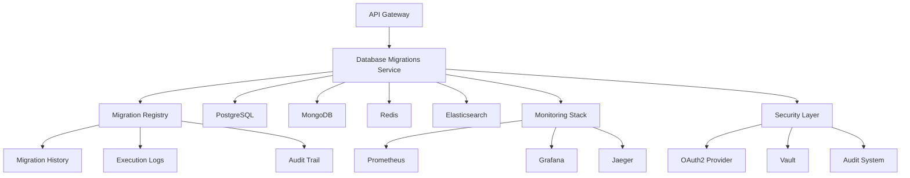

# Database Migrations Service - Documentation

Welcome to the comprehensive documentation for the Database Migrations service, a critical component of the Exalt Social E-commerce Ecosystem. This service provides enterprise-grade database schema management across multiple technologies, environments, and regions.

## 📋 Table of Contents

1. [Overview](#overview)
2. [Quick Start](#quick-start)
3. [Documentation Structure](#documentation-structure)
4. [Architecture](#architecture)
5. [Getting Started](#getting-started)
6. [Operations](#operations)
7. [Best Practices](#best-practices)
8. [Troubleshooting](#troubleshooting)
9. [Contributing](#contributing)
10. [Support](#support)

## 🔍 Overview

The Database Migrations service is designed to handle complex database schema evolution across the entire Exalt Social E-commerce Ecosystem. It supports multiple database technologies, ensures zero-downtime operations, and provides comprehensive audit trails for compliance.

### Key Features

- **Multi-Database Support**: PostgreSQL, MongoDB, Redis, Elasticsearch
- **Zero-Downtime Migrations**: Advanced strategies for continuous availability
- **Multi-Environment Management**: Development, Testing, Staging, Production
- **Multi-Region Support**: Global deployment with regional compliance
- **Enterprise Security**: Role-based access control and comprehensive auditing
- **High Availability**: Distributed architecture with automatic failover
- **Comprehensive Monitoring**: Real-time metrics and alerting

### Technology Stack

- **Runtime**: Java 17, Spring Boot 3.1.x
- **Build Tool**: Maven 3.9+
- **Containerization**: Docker, Kubernetes
- **Databases**: PostgreSQL 13+, MongoDB 5.0+, Redis 6.2+, Elasticsearch 7.15+
- **Migration Tools**: Flyway, Custom MongoDB migrations, Lua scripts for Redis
- **Monitoring**: Prometheus, Grafana, Jaeger
- **Security**: OAuth2, JWT, HashiCorp Vault

## 🚀 Quick Start

### Prerequisites

- Java 17 or later
- Docker and Docker Compose
- Access to database systems
- Kubernetes cluster (for production)

### Local Development Setup

```bash
# Clone the repository
git clone https://github.com/exalt-social-ecommerce-ecosystem/central-configuration/database-migrations.git
cd database-migrations

# Start dependencies
docker-compose up -d postgres redis mongodb elasticsearch

# Configure environment
cp .env.template .env
# Edit .env with your configuration

# Run the application
./mvnw spring-boot:run
```

### Health Check

```bash
curl http://localhost:8892/actuator/health
```

## 📚 Documentation Structure

This documentation is organized into several comprehensive guides:

### [Architecture Documentation](architecture/README.md)
- System architecture and design patterns
- Component interaction diagrams
- Technology-specific implementations
- Multi-region and multi-environment strategies
- Security architecture
- Performance considerations

### [Setup Guide](setup/README.md)
- Installation and configuration instructions
- Environment-specific setup procedures
- Database configuration and user management
- Security configuration
- Monitoring setup
- CI/CD integration

### [Operations Guide](operations/README.md)
- Day-to-day operational procedures
- Migration creation and execution
- Monitoring and alerting
- Troubleshooting guides
- Backup and recovery procedures
- Performance optimization

## 🏗️ Architecture

The Database Migrations service follows a modular, microservices-oriented architecture:



### Core Components

1. **Migration Engine**: Executes database schema changes
2. **Registry Service**: Tracks migration state and history
3. **Validation Layer**: Ensures migration integrity and safety
4. **Security Layer**: Handles authentication, authorization, and auditing
5. **Monitoring Layer**: Provides observability and alerting

## 🏁 Getting Started

### For Developers

1. **Read the Architecture Guide**: Understand the system design and patterns
2. **Follow the Setup Guide**: Configure your development environment
3. **Review Best Practices**: Learn migration standards and conventions
4. **Create Your First Migration**: Use the provided templates and guidelines

### For Operations Teams

1. **Study the Operations Guide**: Learn day-to-day procedures
2. **Set Up Monitoring**: Configure alerts and dashboards
3. **Practice Disaster Recovery**: Test backup and restore procedures
4. **Review Security Procedures**: Understand access controls and auditing

### For Database Administrators

1. **Configure Database Access**: Set up users and permissions
2. **Review Migration Patterns**: Understand zero-downtime strategies
3. **Set Up Backup Procedures**: Ensure data protection
4. **Configure Performance Monitoring**: Track database health

## 🔧 Operations

### Daily Operations

- Monitor migration execution status
- Review performance metrics
- Check security alerts
- Verify backup completion

### Weekly Operations

- Review and approve pending migrations
- Analyze performance trends
- Update security configurations
- Clean up old migration logs

### Monthly Operations

- Generate compliance reports
- Review and update documentation
- Conduct security audits
- Plan capacity upgrades

## 📋 Best Practices

### Migration Development

1. **One Change Per Migration**: Keep migrations focused and atomic
2. **Backwards Compatibility**: Ensure migrations don't break existing functionality
3. **Test Thoroughly**: Validate migrations in development before promotion
4. **Document Changes**: Provide clear descriptions and rollback procedures

### Security

1. **Principle of Least Privilege**: Grant minimal necessary permissions
2. **Regular Audits**: Review access logs and permissions regularly
3. **Secure Credentials**: Use proper secrets management
4. **Encrypt Sensitive Data**: Protect data in transit and at rest

### Performance

1. **Optimize for Scale**: Consider large dataset impacts
2. **Monitor Resource Usage**: Track CPU, memory, and storage
3. **Index Management**: Ensure proper indexing strategies
4. **Batch Operations**: Use batching for large data migrations

## 🐛 Troubleshooting

### Common Issues

| Issue | Symptoms | Solution |
|-------|----------|----------|
| Migration Failure | Failed status in logs | Check database connectivity and permissions |
| Slow Performance | High execution times | Review migration complexity and database load |
| Connection Issues | Cannot connect to database | Verify network connectivity and credentials |
| Authorization Errors | Access denied messages | Check user roles and permissions |

### Diagnostic Tools

- **Health Endpoints**: `/actuator/health` for service status
- **Metrics Endpoints**: `/actuator/metrics` for performance data
- **Log Analysis**: Structured logging with correlation IDs
- **Database Monitoring**: Performance query analysis

### Emergency Procedures

1. **Migration Rollback**: Use built-in rollback procedures
2. **Service Recovery**: Restart procedures with health checks
3. **Data Recovery**: Point-in-time restore from backups
4. **Escalation**: Contact procedures for critical issues

## 🤝 Contributing

We welcome contributions to improve the Database Migrations service. Please follow these guidelines:

### Development Workflow

1. Fork the repository
2. Create a feature branch
3. Follow coding standards
4. Write comprehensive tests
5. Update documentation
6. Submit a pull request

### Code Standards

- Follow Java coding conventions
- Use meaningful variable and method names
- Write comprehensive Javadoc comments
- Ensure 80%+ test coverage
- Follow security best practices

### Documentation Standards

- Use clear, concise language
- Include practical examples
- Update all relevant sections
- Follow markdown conventions
- Include diagrams where helpful

## 📞 Support

### Getting Help

- **Documentation**: Check this comprehensive guide first
- **Issues**: Create GitHub issues for bugs and feature requests
- **Discussions**: Use GitHub Discussions for questions and ideas
- **Email**: Contact the team at database-migrations@exalt-ecommerce.com

### Emergency Support

For production issues requiring immediate attention:

- **Slack**: #database-migrations-emergency
- **PagerDuty**: Integration for critical alerts
- **Phone**: +1-XXX-XXX-XXXX (24/7 support)

### Team Contacts

- **Lead Developer**: john.smith@exalt-ecommerce.com
- **Database Administrator**: jane.doe@exalt-ecommerce.com
- **DevOps Lead**: mike.johnson@exalt-ecommerce.com
- **Security Officer**: sarah.wilson@exalt-ecommerce.com

## 📈 Roadmap

### Upcoming Features

- **Q3 2024**: AI-powered migration optimization
- **Q4 2024**: Enhanced multi-cloud support
- **Q1 2025**: Advanced compliance reporting
- **Q2 2025**: Real-time schema synchronization

### Version History

- **v1.0.0**: Initial release with basic migration support
- **v1.1.0**: Added MongoDB and Redis support
- **v1.2.0**: Enhanced security and auditing
- **v1.3.0**: Multi-region support and disaster recovery
- **v2.0.0**: Complete architectural redesign (current)

## 📜 License

This project is licensed under the MIT License - see the [LICENSE](LICENSE) file for details.

## 🔗 Related Documentation

- [Exalt E-commerce Architecture](https://docs.exalt-ecommerce.com/architecture)
- [Database Design Guidelines](https://docs.exalt-ecommerce.com/database-design)
- [Security Standards](https://docs.exalt-ecommerce.com/security)
- [Monitoring and Observability](https://docs.exalt-ecommerce.com/monitoring)
- [Deployment Guidelines](https://docs.exalt-ecommerce.com/deployment)

## Compliance

The Database Migrations implementation complies with:

- **ISO 27001**: Information Security Management
- **ISO 22301**: Business Continuity Management
- **PCI DSS**: Secure handling of payment data
- **GDPR**: Data protection and privacy for European operations
- **POPIA**: Data protection for African markets
- **SOX**: Financial controls and reporting
- **Enterprise Standards**: Database management best practices

---

*Last updated: June 2024*  
*Version: 2.0.0*  
*Maintained by: Exalt E-commerce Platform Team*
