# Deployment Scripts Service - Architecture Documentation

**Version:** 1.0.0  
**Service:** Deployment Scripts Service  
**Domain:** Central Configuration  
**Spring Boot:** 3.1.5  
**Java:** 17+

## Table of Contents

1. [Service Overview](#service-overview)
2. [Architecture Patterns](#architecture-patterns)
3. [System Architecture](#system-architecture)
4. [Component Architecture](#component-architecture)
5. [Deployment Orchestration](#deployment-orchestration)
6. [Environment Management](#environment-management)
7. [Rollback Mechanisms](#rollback-mechanisms)
8. [Security Architecture](#security-architecture)
9. [Integration Architecture](#integration-architecture)
10. [Performance Architecture](#performance-architecture)
11. [Scalability Considerations](#scalability-considerations)
12. [Disaster Recovery](#disaster-recovery)

## Service Overview

The Deployment Scripts Service is the central automation hub for the Exalt Social E-commerce Ecosystem, providing enterprise-grade deployment orchestration, script management, and environment provisioning across multiple platforms and environments.

### Business Context

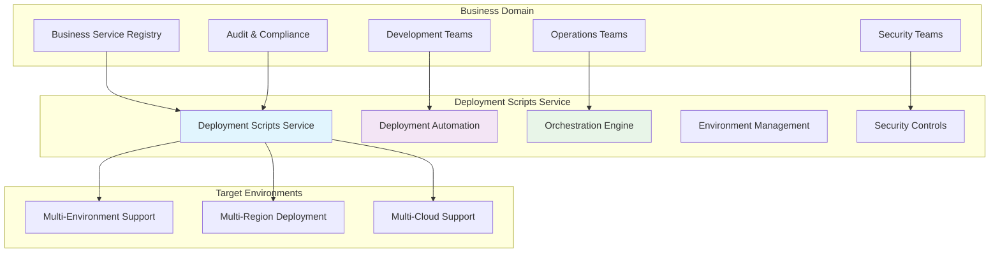

## Architecture Patterns

### 1. Domain-Driven Design (DDD)

The service follows DDD principles with clear domain boundaries:

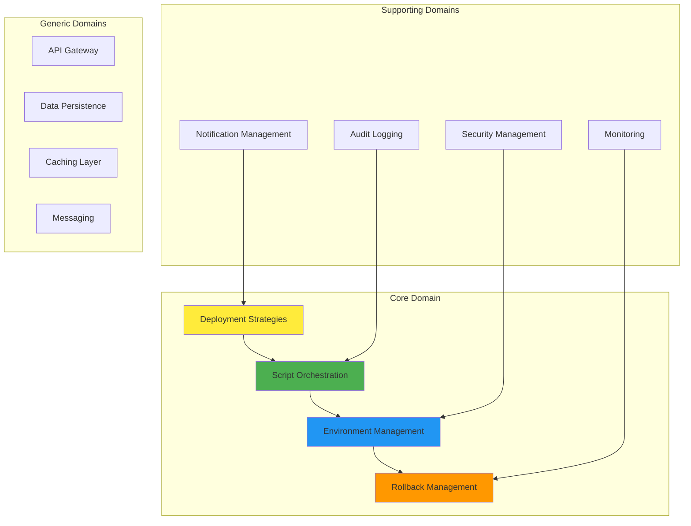

### 2. Hexagonal Architecture (Ports and Adapters)

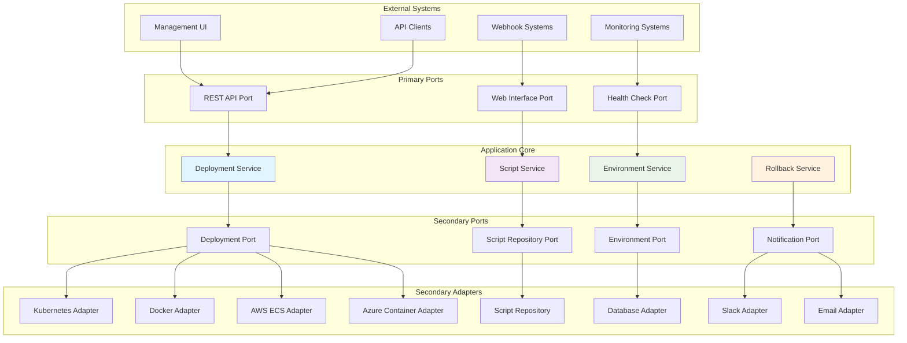

### 3. Event-Driven Architecture

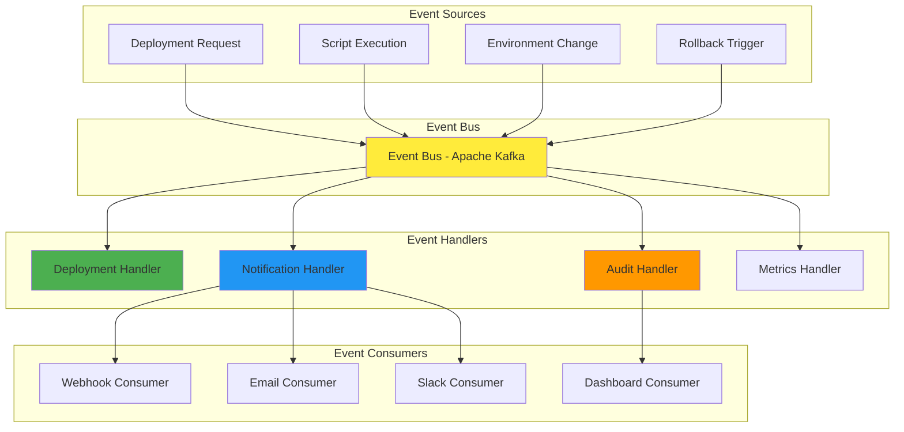

## System Architecture

### High-Level System Architecture

```mermaid
graph TB
    subgraph "Load Balancer Layer"
        LB[Load Balancer - AWS ALB/NGINX]
    end
    
    subgraph "API Gateway Layer"
        AG[API Gateway - Spring Cloud Gateway]
        RATE[Rate Limiting]
        AUTH[Authentication]
        CIRCUIT[Circuit Breaker]
    end
    
    subgraph "Service Layer"
        DS1[Deployment Scripts Instance 1]
        DS2[Deployment Scripts Instance 2]
        DS3[Deployment Scripts Instance 3]
    end
    
    subgraph "Service Discovery"
        EUREKA[Eureka Service Registry]
        CONFIG[Config Server]
    end
    
    subgraph "Data Layer"
        POSTGRES[PostgreSQL - Primary DB]
        REDIS[Redis - Cache & Sessions]
        KAFKA[Apache Kafka - Event Streaming]
    end
    
    subgraph "External Integrations"
        K8S[Kubernetes Clusters]
        AWS[AWS ECS/EC2]
        AZURE[Azure Container Instances]
        DOCKER[Docker Swarm]
        GIT[Git Repositories]
    end
    
    subgraph "Monitoring & Logging"
        PROMETHEUS[Prometheus]
        GRAFANA[Grafana]
        ELK[ELK Stack]
        JAEGER[Jaeger Tracing]
    end
    
    LB --> AG
    AG --> RATE
    AG --> AUTH
    AG --> CIRCUIT
    
    AG --> DS1
    AG --> DS2
    AG --> DS3
    
    DS1 --> EUREKA
    DS2 --> EUREKA
    DS3 --> EUREKA
    
    DS1 --> CONFIG
    DS2 --> CONFIG
    DS3 --> CONFIG
    
    DS1 --> POSTGRES
    DS2 --> POSTGRES
    DS3 --> POSTGRES
    
    DS1 --> REDIS
    DS2 --> REDIS
    DS3 --> REDIS
    
    DS1 --> KAFKA
    DS2 --> KAFKA
    DS3 --> KAFKA
    
    DS1 --> K8S
    DS1 --> AWS
    DS1 --> AZURE
    DS1 --> DOCKER
    DS1 --> GIT
    
    DS1 --> PROMETHEUS
    DS2 --> PROMETHEUS
    DS3 --> PROMETHEUS
    
    style DS1 fill:#e1f5fe
    style DS2 fill:#e1f5fe
    style DS3 fill:#e1f5fe
```

### Service Internal Architecture

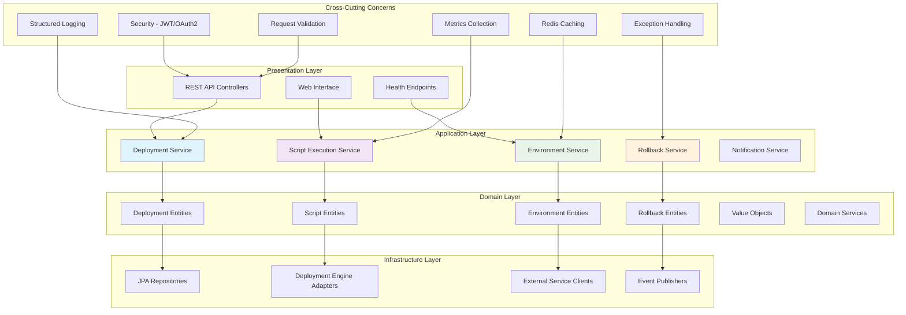

## Component Architecture

### Deployment Engine Architecture

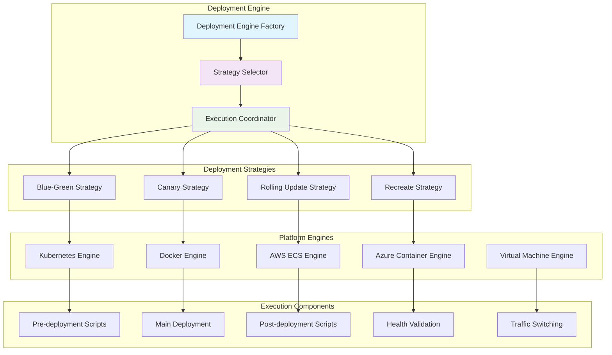

### Script Management Architecture

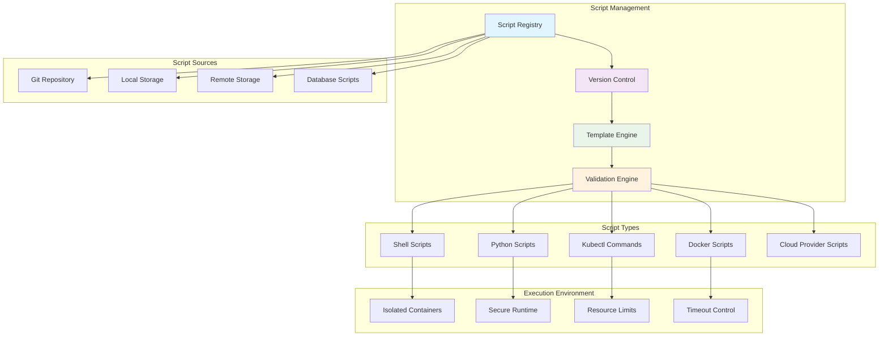

## Deployment Orchestration

### Orchestration Flow Architecture

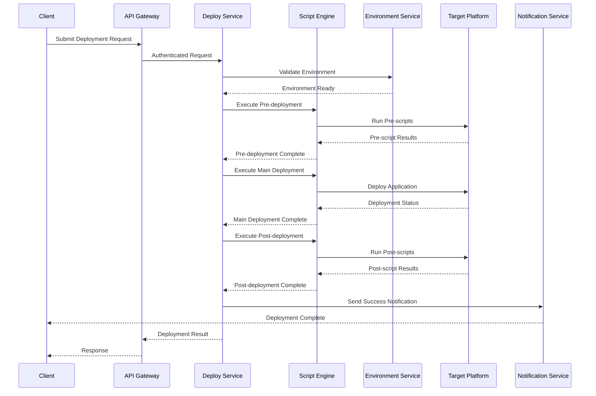

### Multi-Environment Orchestration

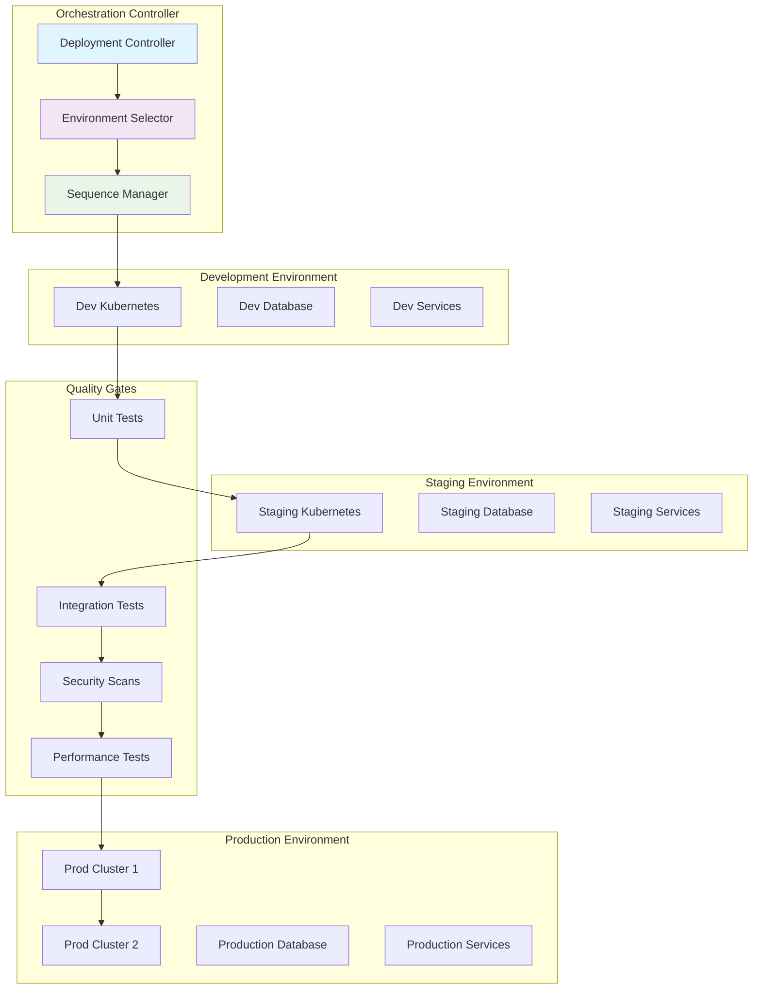

## Environment Management

### Environment Provisioning Architecture

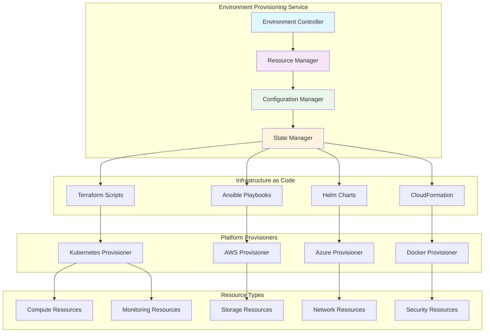

### Environment Configuration Management

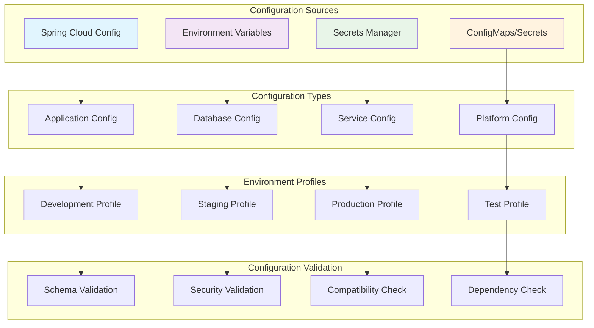

## Rollback Mechanisms

### Rollback Strategy Architecture

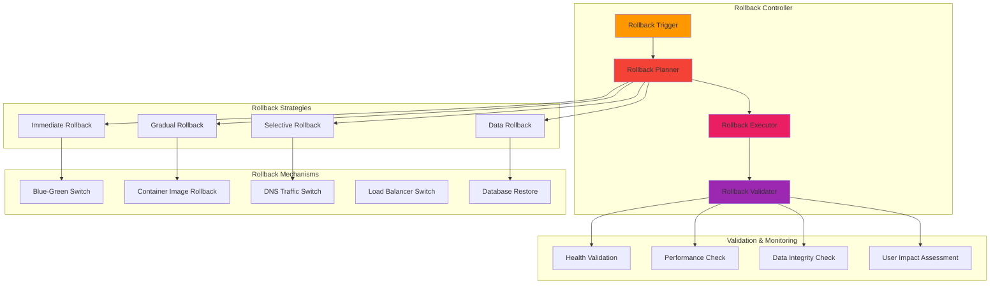

### Automated Rollback Decision Tree

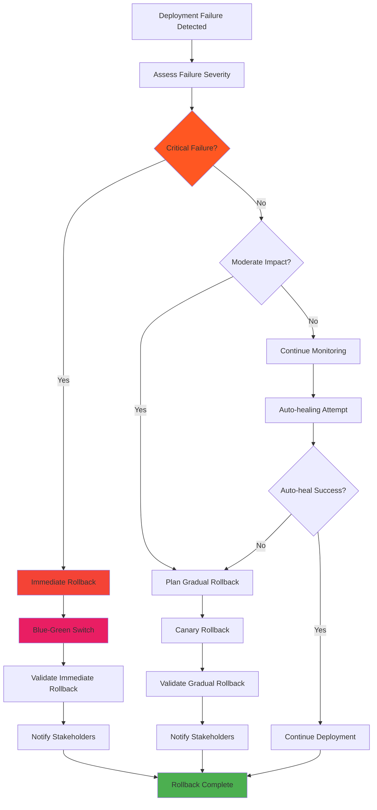

## Security Architecture

### Security Layer Architecture

```mermaid
graph TB
    subgraph "Authentication & Authorization"
        AUTH_GATEWAY[Authentication Gateway]
        JWT_PROVIDER[JWT Token Provider]
        OAUTH2[OAuth2 Integration]
        RBAC[Role-Based Access Control]
    end
    
    subgraph "API Security"
        RATE_LIMITING[Rate Limiting]
        INPUT_VALIDATION[Input Validation]
        SQL_INJECTION[SQL Injection Protection]
        XSS_PROTECTION[XSS Protection]
    end
    
    subgraph "Script Security"
        SCRIPT_SCANNING[Script Security Scanning]
        SANDBOX_EXECUTION[Sandboxed Execution]
        PRIVILEGE_ESCALATION[Privilege Control]
        RESOURCE_LIMITS[Resource Limitations]
    end
    
    subgraph "Data Security"
        ENCRYPTION_TRANSIT[Encryption in Transit]
        ENCRYPTION_REST[Encryption at Rest]
        SECRETS_MANAGEMENT[Secrets Management]
        DATA_MASKING[Data Masking]
    end
    
    subgraph "Network Security"
        NETWORK_POLICIES[Network Policies]
        FIREWALL_RULES[Firewall Rules]
        VPN_ACCESS[VPN Access]
        ZERO_TRUST[Zero Trust Architecture]
    end
    
    AUTH_GATEWAY --> JWT_PROVIDER
    JWT_PROVIDER --> OAUTH2
    OAUTH2 --> RBAC
    
    RBAC --> RATE_LIMITING
    RATE_LIMITING --> INPUT_VALIDATION
    INPUT_VALIDATION --> SQL_INJECTION
    SQL_INJECTION --> XSS_PROTECTION
    
    XSS_PROTECTION --> SCRIPT_SCANNING
    SCRIPT_SCANNING --> SANDBOX_EXECUTION
    SANDBOX_EXECUTION --> PRIVILEGE_ESCALATION
    PRIVILEGE_ESCALATION --> RESOURCE_LIMITS
    
    RESOURCE_LIMITS --> ENCRYPTION_TRANSIT
    ENCRYPTION_TRANSIT --> ENCRYPTION_REST
    ENCRYPTION_REST --> SECRETS_MANAGEMENT
    SECRETS_MANAGEMENT --> DATA_MASKING
    
    DATA_MASKING --> NETWORK_POLICIES
    NETWORK_POLICIES --> FIREWALL_RULES
    FIREWALL_RULES --> VPN_ACCESS
    VPN_ACCESS --> ZERO_TRUST
    
    style AUTH_GATEWAY fill:#ff5722
    style SCRIPT_SCANNING fill:#f44336
    style ENCRYPTION_TRANSIT fill:#e91e63
    style NETWORK_POLICIES fill:#9c27b0
```

### Security Compliance Framework

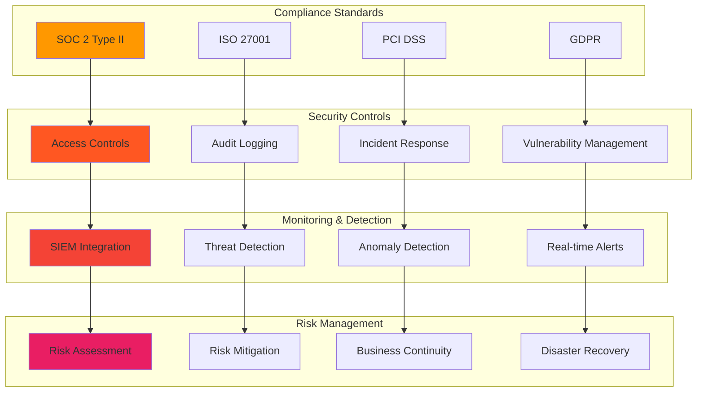

## Integration Architecture

### External System Integration

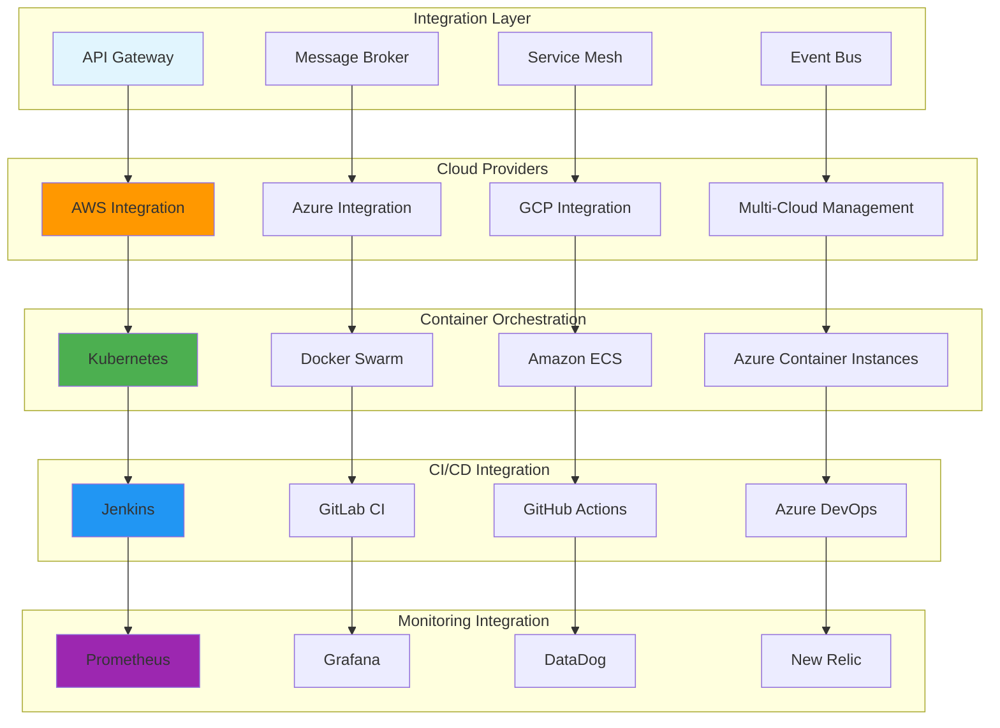

### Service Communication Patterns

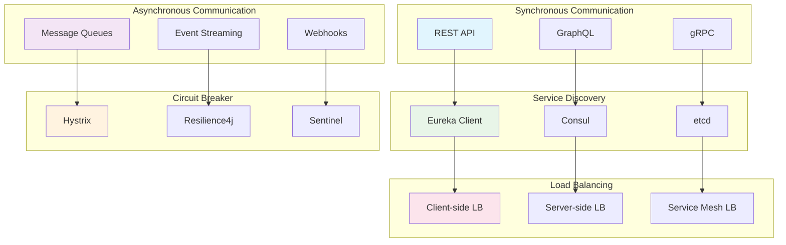

## Performance Architecture

### Performance Optimization Strategy

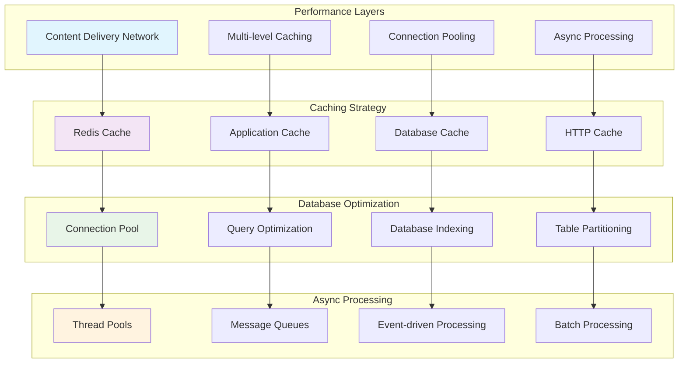

### Scalability Architecture

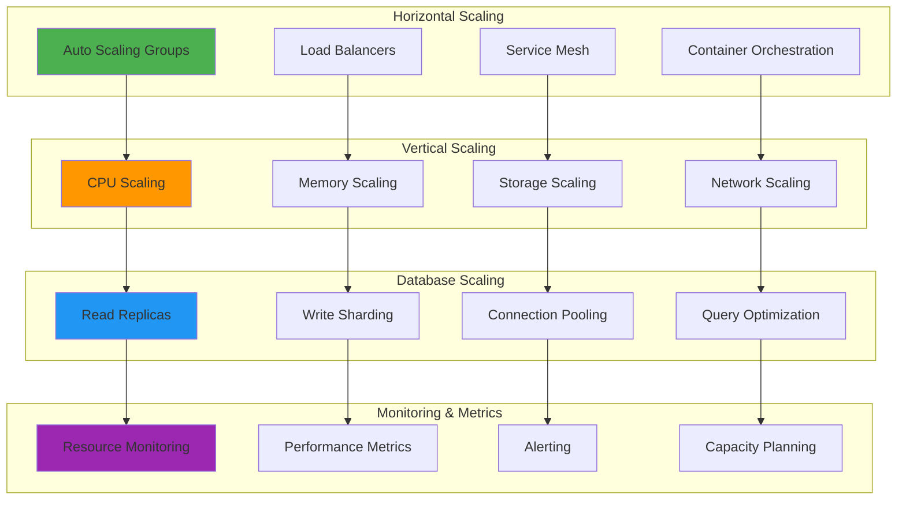

## Scalability Considerations

### Multi-Region Deployment Architecture

```mermaid
graph TB
    subgraph "Global Load Balancer"
        GLOBAL_LB[Global Load Balancer]
        DNS_ROUTING[DNS-based Routing]
        GEOGRAPHIC_ROUTING[Geographic Routing]
        LATENCY_ROUTING[Latency-based Routing]
    end
    
    subgraph "Region 1 - US East"
        US_EAST_LB[Regional Load Balancer]
        US_EAST_CLUSTER[Deployment Scripts Cluster]
        US_EAST_DB[PostgreSQL Primary]
        US_EAST_CACHE[Redis Cluster]
    end
    
    subgraph "Region 2 - EU West"
        EU_WEST_LB[Regional Load Balancer]
        EU_WEST_CLUSTER[Deployment Scripts Cluster]
        EU_WEST_DB[PostgreSQL Replica]
        EU_WEST_CACHE[Redis Cluster]
    end
    
    subgraph "Region 3 - Asia Pacific"
        APAC_LB[Regional Load Balancer]
        APAC_CLUSTER[Deployment Scripts Cluster]
        APAC_DB[PostgreSQL Replica]
        APAC_CACHE[Redis Cluster]
    end
    
    subgraph "Data Synchronization"
        DB_REPLICATION[Database Replication]
        CACHE_SYNC[Cache Synchronization]
        CONFIG_SYNC[Configuration Sync]
        SCRIPT_SYNC[Script Repository Sync]
    end
    
    GLOBAL_LB --> DNS_ROUTING
    DNS_ROUTING --> GEOGRAPHIC_ROUTING
    GEOGRAPHIC_ROUTING --> LATENCY_ROUTING
    
    LATENCY_ROUTING --> US_EAST_LB
    LATENCY_ROUTING --> EU_WEST_LB
    LATENCY_ROUTING --> APAC_LB
    
    US_EAST_LB --> US_EAST_CLUSTER
    EU_WEST_LB --> EU_WEST_CLUSTER
    APAC_LB --> APAC_CLUSTER
    
    US_EAST_CLUSTER --> US_EAST_DB
    EU_WEST_CLUSTER --> EU_WEST_DB
    APAC_CLUSTER --> APAC_DB
    
    US_EAST_DB --> DB_REPLICATION
    EU_WEST_DB --> DB_REPLICATION
    APAC_DB --> DB_REPLICATION
    
    US_EAST_CACHE --> CACHE_SYNC
    EU_WEST_CACHE --> CACHE_SYNC
    APAC_CACHE --> CACHE_SYNC
    
    style GLOBAL_LB fill:#ff9800
    style US_EAST_CLUSTER fill:#4caf50
    style EU_WEST_CLUSTER fill:#2196f3
    style APAC_CLUSTER fill:#9c27b0
    style DB_REPLICATION fill:#ff5722
```

## Disaster Recovery

### Disaster Recovery Strategy

```mermaid
graph TB
    subgraph "Disaster Detection"
        HEALTH_MONITORING[Health Monitoring]
        FAILURE_DETECTION[Failure Detection]
        IMPACT_ASSESSMENT[Impact Assessment]
        ESCALATION[Escalation Matrix]
    end
    
    subgraph "Recovery Procedures"
        AUTOMATED_FAILOVER[Automated Failover]
        MANUAL_INTERVENTION[Manual Intervention]
        DATA_RECOVERY[Data Recovery]
        SERVICE_RESTORATION[Service Restoration]
    end
    
    subgraph "Backup Strategy"
        DATABASE_BACKUP[Database Backup]
        CONFIGURATION_BACKUP[Configuration Backup]
        SCRIPT_BACKUP[Script Repository Backup]
        STATE_BACKUP[Application State Backup]
    end
    
    subgraph "Recovery Testing"
        DR_DRILLS[Disaster Recovery Drills]
        RECOVERY_TESTING[Recovery Testing]
        RTO_VALIDATION[RTO Validation]
        RPO_VALIDATION[RPO Validation]
    end
    
    HEALTH_MONITORING --> AUTOMATED_FAILOVER
    FAILURE_DETECTION --> MANUAL_INTERVENTION
    IMPACT_ASSESSMENT --> DATA_RECOVERY
    ESCALATION --> SERVICE_RESTORATION
    
    AUTOMATED_FAILOVER --> DATABASE_BACKUP
    MANUAL_INTERVENTION --> CONFIGURATION_BACKUP
    DATA_RECOVERY --> SCRIPT_BACKUP
    SERVICE_RESTORATION --> STATE_BACKUP
    
    DATABASE_BACKUP --> DR_DRILLS
    CONFIGURATION_BACKUP --> RECOVERY_TESTING
    SCRIPT_BACKUP --> RTO_VALIDATION
    STATE_BACKUP --> RPO_VALIDATION
    
    style HEALTH_MONITORING fill:#ff5722
    style AUTOMATED_FAILOVER fill:#f44336
    style DATABASE_BACKUP fill:#e91e63
    style DR_DRILLS fill:#9c27b0
```

### Business Continuity Architecture

```mermaid
graph TB
    subgraph "Primary Site"
        PRIMARY_DC[Primary Data Center]
        PRIMARY_SERVICES[Primary Services]
        PRIMARY_DB[Primary Database]
        PRIMARY_STORAGE[Primary Storage]
    end
    
    subgraph "Secondary Site"
        SECONDARY_DC[Secondary Data Center]
        SECONDARY_SERVICES[Standby Services]
        SECONDARY_DB[Replica Database]
        SECONDARY_STORAGE[Replica Storage]
    end
    
    subgraph "Cloud Backup"
        CLOUD_SERVICES[Cloud Services]
        CLOUD_DB[Cloud Database]
        CLOUD_STORAGE[Cloud Storage]
        CLOUD_MONITORING[Cloud Monitoring]
    end
    
    subgraph "Recovery Coordination"
        RECOVERY_ORCHESTRATOR[Recovery Orchestrator]
        TRAFFIC_MANAGER[Traffic Manager]
        DATA_SYNC[Data Synchronization]
        HEALTH_CHECKER[Health Checker]
    end
    
    PRIMARY_DC --> SECONDARY_DC
    PRIMARY_SERVICES --> SECONDARY_SERVICES
    PRIMARY_DB --> SECONDARY_DB
    PRIMARY_STORAGE --> SECONDARY_STORAGE
    
    SECONDARY_DC --> CLOUD_SERVICES
    SECONDARY_SERVICES --> CLOUD_DB
    SECONDARY_DB --> CLOUD_STORAGE
    SECONDARY_STORAGE --> CLOUD_MONITORING
    
    CLOUD_SERVICES --> RECOVERY_ORCHESTRATOR
    CLOUD_DB --> TRAFFIC_MANAGER
    CLOUD_STORAGE --> DATA_SYNC
    CLOUD_MONITORING --> HEALTH_CHECKER
    
    style PRIMARY_DC fill:#4caf50
    style SECONDARY_DC fill:#ff9800
    style CLOUD_SERVICES fill:#2196f3
    style RECOVERY_ORCHESTRATOR fill:#9c27b0
```

---

## Architecture Governance

### Design Principles

1. **Separation of Concerns**: Clear boundaries between deployment logic, script management, and platform integration
2. **Single Responsibility**: Each component has a single, well-defined purpose
3. **Dependency Inversion**: High-level modules don't depend on low-level modules
4. **Open/Closed Principle**: Open for extension, closed for modification
5. **Interface Segregation**: Clients don't depend on interfaces they don't use

### Quality Attributes

1. **Availability**: 99.99% uptime with multi-region deployment
2. **Scalability**: Horizontal and vertical scaling capabilities
3. **Performance**: Sub-second response times for API calls
4. **Security**: Enterprise-grade security with compliance standards
5. **Maintainability**: Clean architecture with comprehensive testing
6. **Reliability**: Robust error handling and recovery mechanisms

### Technology Decisions

1. **Spring Boot**: Enterprise Java framework for rapid development
2. **PostgreSQL**: ACID-compliant relational database for transactional data
3. **Redis**: In-memory data store for caching and session management
4. **Apache Kafka**: Event streaming platform for asynchronous communication
5. **Kubernetes**: Container orchestration for deployment and scaling
6. **Prometheus/Grafana**: Monitoring and observability stack

---

**Document Version**: 1.0.0  
**Last Updated**: June 25, 2025  
**Maintained By**: Platform Infrastructure Team  
**Review Cycle**: Quarterly